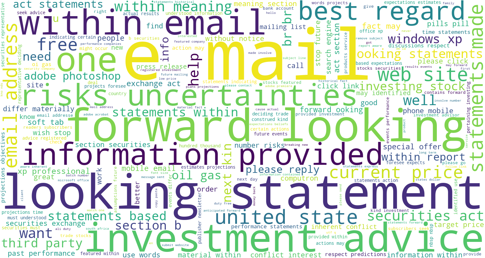
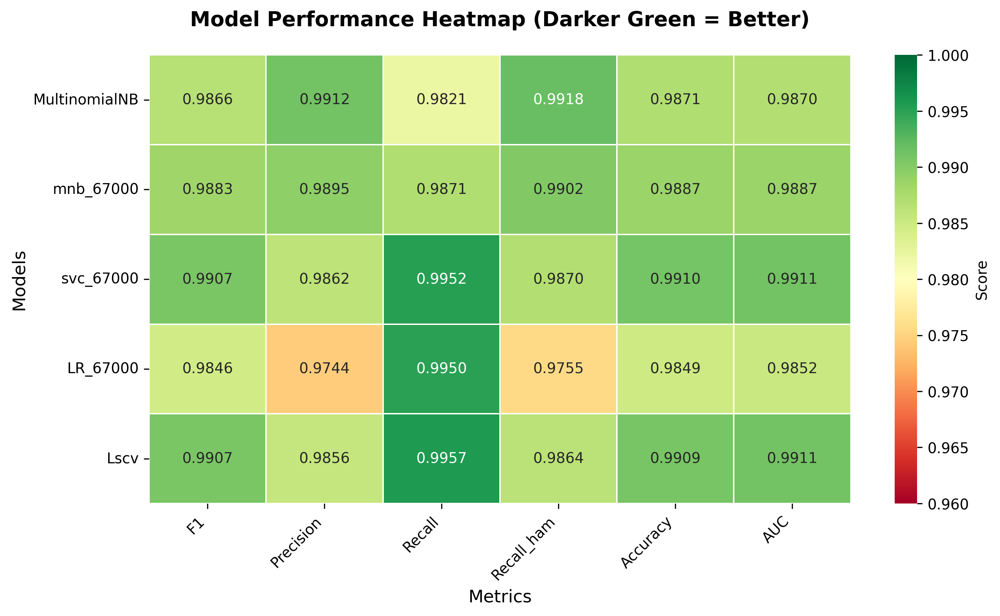

# Email Spam Detection System

[](https://www.python.org/downloads/)
[](.)
[](https://flask.palletsprojects.com/)
[](https://aws.amazon.com/lambda/)
[](https://ohw3i64ker6qr3sablgjbszvhi0rxntm.lambda-url.us-west-1.on.aws/)
[](LICENSE)

##  [Project Overview](#project-overview)

##  Project Overview

An end-to-end machine learning project that detects spam emails with **99.44% accuracy**, matching Gmail's industry-standard performance (~99.5%). The project demonstrates the complete ML lifecycle from data analysis to cloud deployment, with a focus on cost optimization and production best practices.

**Key Highlights:**
-  Analyzed and cleaned 33,716 emails from the Enron dataset
- Trained and compared 4 ML algorithms (LinearSVC achieved best results)
- Built Flask web application with REST API
- Deployed to AWS with cost optimization: **$54/month → $0-2/month**
- Containerized with Docker for serverless Lambda deployment

---

## Table of Contents
- [Dataset](#dataset)
- [Project Workflow](#project-workflow)
- [Project Structure](#project-structure)
- [Model Performance](#model-performance)
- [Deployment Journey](#deployment-journey)
- [Quick Start](#quick-start)
- [Technologies Used](#️technologies-used)
- [Future Improvements](#future-improvements)
- [License](#license)
- [Contact](#contact)

---

## Dataset

- **Source:** [Enron Spam Dataset](https://github.com/MWiechmann/enron_spam_data)
- **Total Emails:** 33,716 (51% spam, 49% ham)
- **Train/Test Split:** 80/20 stratified split (26,973 train / 6,743 test)
- **Features:** Email subject, message body, timestamp

**Note:** Raw and cleaned datasets are not included in the repository due to size constraints. Pre-processed train/test splits (X_train, X_test, y_train, y_test) are provided. Download raw data from the [source repository](https://github.com/MWiechmann/enron_spam_data/tree/master) if needed.

---

## Project Workflow

### 1. **Data Analysis & Cleaning** 
[Go to Notebook](notebooks/01_data_analysis.ipynb). 

The model was trained on the Enron spam dataset, which required extensive text cleaning and preprocessing:

**Dataset Characteristics:**
    - **Total emails:** 33,716  
    - **Spam:** 17,171 so 50.9%  
    - **Ham (legitimate):** 16545 so 49.07%  
    - **Balance:** Well-balanced dataset    

**Data Loading:** Import 33,716 emails   
**Cleaning Steps:**
- Removed duplicates which means entries that had the same date, subject, message and label were considered duplicates and were removed.
- Emails with missing message and subject or missing only message will be deleted because they offer no value
- Emails with missing subject only it was replaced with 'no subject'   

**Feature Engineering:** New features were created:   
- day_of_week --> Monday =0 to Sunday = 6.  
- repeat_freq --> how many times the email shows up in the data.   
- combined_text --> combine subject and message.   

**Text Preprocessing:** Converted combined_tect to lowercase and removed whitespace:   
 - Kept punctuation and special characters becuase they are important for spam detection. Many spam emails have many special characters like '!'  
- Applied TfidfVectorizer to combined_text

**Output:** Cleaned dataset saved to `data/cleaned_data.csv`

### Text Analysis

After cleaning, we analyzed word patterns in spam vs legitimate emails:  
### These are the most frequent words in spam messages after preprocessing


### These are the most frequent words in ham/legitimate messages after preprocessing



**Key Observations:**
- Spam emails frequently contain words like "free", "win", "prize", "click"
- Legitimate emails show more professional vocabulary and context-specific terms
- TF-IDF vectorization effectively captures these distinctions

For detailed analysis and visualizations, see `notebooks/data_exploration.ipynb`

### 2. **Model Training & Evaluation**  
[Go to Notebook](notebooks/02_model_selection.ipynb)  
This notebook handles model development and comparison:
- **Feature Engineering:**
  - TF-IDF vectorization (67,000 features optimized via GridSearchCV)
  - Temporal features (day_of_week, repeat_frequency)
- **Model Comparison:** Trained and evaluated 4 algorithms:
  - MultinomialNB (baseline)
  - Logistic Regression
  - Linear SVM (LinearSVC) ✅ **Selected**
  - Kernel SVM (SVC with linear kernel)
- **Hyperparameter Tuning:** GridSearchCV with 5-fold cross-validation
- **Model Evaluation:** Accuracy, F1-score, Precision, Recall on hold-out test set
- **Output:** Trained LinearSVC model saved to `src/models/spam_trained_model.joblib`

### 3. **Web Application Development** 
[Spam Detector Folder](spam_detector/)

Flask-based web interface and REST API:
- **Frontend:** HTML/CSS interface for manual email classification
- **Backend:** Flask server with prediction endpoints
- **API:** RESTful endpoints for programmatic access
- **Model Integration:** Load and serve trained LinearSVC model

### 4. **Cloud Deployment**
**Evolution:** Flask Local → AWS Elastic Beanstalk → AWS Lambda (Docker)
- **Initial:** AWS Elastic Beanstalk deployment
- **Cost Issue:** Discovered $54/month charges from ALB and EC2
- **Solution:** Migrated to AWS Lambda with Docker containers
- **Result:** Reduced costs to $0-2/month while maintaining functionality

---

## Project Structure
```
spam-spam-classifier/
├── README.md                           # This file
├── LICENSE                             # MIT License
├── .gitignore                          # Git ignore rules
├── requirements.txt                    # Project dependencies
│
├── notebooks/                          # Jupyter notebooks for analysis
│   ├── 01_data_analysis.ipynb         # EDA, cleaning, feature engineering
│   └── 02_model_selection.ipynb       # Model training and evaluation
│
├── src/                                # Source code modules
│   ├── __init__.py
│   ├── clean_emails.py                # Data cleaning functions
│   ├── model_fit.py                   # Model training utilities
│   └── models/
│       └── spam_trained_model.joblib  # Trained LinearSVC model
│
├── data/                               # Dataset files
│   ├── X_train.csv                    # Training features
│   ├── y_train.csv                    # Training labels
│   ├── X_test.csv                     # Test features
│   └── y_test.csv                     # Test labels
│
└── spam_detector/                      # Flask web application running on AWS Elastic Beanstalk
│   ├── README.md                       # Deployment documentation
│   ├── app.py                          # Flask application entry point
│   ├── application.py                  # EB-compatible entry point
│   ├── requirements.txt                # Flask dependencies                     
│   ├── templates/
│   │   ├── base.html                  # HTML base template
│   │   └── index.html                 # Main web interface
│   └── static/
│   │      └── style.css               # Styling
│   └── tempaltes/
│   │   └── base.html
│   │   └── index.html
│   │   
└── spam_detector_amlbda/               # Flask web application running on AWS Lambda
  ├── README.md                       # Deployment documentation
  ├── app.py                          # Flask application entry point              
  ├── requirements.txt                # Lambda and Flask dependencies
  ├── Dockerfile                      # Docker configuration for Lambda
  └── static/
  │      └── style.css               # Styling
  └── tempaltes/
        └── base.html
        └── index.html

```

---

## Model Performance

### Cross-Validation Results (5-Fold)
[Cross Validation scores](/data/scores_df_test.csv)

| Model | Accuracy | F1 Score | Precision | Recall | AUC Score|
|-------|----------|----------|-----------|--------|--------|
| MultinomialNB | 98.87% | 0.9883 | 0.9895 | 0.9871 |0.9887 |
| Logistic Regression | 98.49% | 0.9845 | 0.9856 | 0.9852 | 0.985 |
| SVC (Linear Kernel) | 99.10% | 0.9907 | 0.9862 | 0.9952 | 0.991 |
| **LinearSVC**  | **99.09%** | **0.9907** | **0.9856** | **0.9911** | **0.991**|
| test_set with LinearSCV | 99.42% | 0.9942 | 0.9912 | 0.9972 | 0.9998 |

### Final Test Set Evaluation

**LinearSVC Performance:**
- **Accuracy:** 99.44%
- **F1 Score:** 0.9942
- **Precision:** 0.9912
- **Recall:** 0.9972

**Confusion Matrix:**
- Correctly classified: **6,705 / 6,743 emails**
- False Positives: 29 (0.43% - ham marked as spam)
- False Negatives: 9 (0.13% - spam marked as ham)

**Model Selection Rationale:**
- **LinearSVC** was chosen for production deployment because:
  - Optimized for high-dimensional sparse data (67,000 TF-IDF features)
  - 4-5× faster inference than kernel SVC
  - Linear decision boundary exploits natural text separability
  - Industry-proven for text classification tasks
  - Test performance (99.44%) exceeded cross-validation (99.09%), demonstrating strong generalization

### This is the heat map of all the models' performance, the deeper the green the higher the score

- Heatmap shows LinearSVC (Lscv) dominates across metrics and it
performs better especially at minimizing legitimate emails misclassified as spam 
---

## Deployment Journey

### Phase 1: AWS Elastic Beanstalk
**Initial deployment to AWS EB for easy setup and management:**  
[See README file for detailed deployment instructions for EB](/spam_detector/README.md)
- Created Flask application with `application.py` entry point
- Configured EB environment with Python 3.10
- Deployed via EB CLI
- **Issue:** Monthly costs of **$54** due to Application Load Balancer and EC2 instance

### Phase 2: Cost Optimization → AWS Lambda
**Migrated to serverless architecture to eliminate ongoing costs:**  
[See the README file for detailed deployment instructions for lambda](/spam_app_lambda/README.md)

[Click here for a Live Demo](https://ohw3i64ker6qr3sablgjbszvhi0rxntm.lambda-url.us-west-1.on.aws/)

**Steps Taken:**
1. **Dockerized the Flask application**
   - Created `Dockerfile` with Python 3.10 slim base
   - Used **gunicorn** as WSGI server with AWS Lambda Web Adapter
   - Built multi-architecture image for Lambda ARM64

2. **AWS Lambda Setup**
   - Pushed Docker image to Amazon ECR
   - Created Lambda function from container image
   - Configured Lambda Function URL for HTTP access
   - Set appropriate IAM roles and permissions

3. **Cost Comparison**
   | Platform | Monthly Cost | Architecture |
   |----------|--------------|--------------|
   | AWS Elastic Beanstalk | **$54** | EC2 + ALB (always-on) |
   | AWS Lambda | **$0-2** | Serverless (pay-per-request) |

**Result:** **96% cost reduction** while maintaining full functionality

---

##  Quick Start

### 1. Clone Repository
```bash
git clone https://github.com/rimesaad/spam-detector.git
cd spam-detector
```

### 2. Set Up Environment
```bash
# Create virtual environment
python -m venv venv

# Activate environment
# On Mac/Linux:
source venv/bin/activate
# On Windows:
venv\Scripts\activate

# Install dependencies
pip install -r requirements.txt
```

### 3. Explore the Notebooks
```bash
# Launch Jupyter
jupyter notebook

# Open notebooks in order:
# 1. notebooks/01_data_analysis.ipynb
# 2. notebooks/02_model_selection.ipynb
```

### 4. Run Flask App Locally
```bash
cd spam_detector
pip install -r requirements.txt
python app.py

# Navigate to http://localhost:5000
```

### 5. Test the API
```bash
# Test prediction endpoint
curl -X POST http://localhost:5000/predict \
  -H "Content-Type: application/json" \
  -d '{"email": "URGENT! You won a prize. Click here NOW!"}'
```
- Or to test the web app got to
[this website and type in an email](https://ohw3i64ker6qr3sablgjbszvhi0rxntm.lambda-url.us-west-1.on.aws/)
---

## Technologies Used

**Machine Learning & Data Science:**
- Python 3.10
- Scikit-learn (LinearSVC, TfidfVectorizer, Pipeline)
- Pandas & NumPy
- NLTK (text processing)
- Matplotlib & Seaborn (visualization)
- Joblib (model serialization)

**Web Development:**
- Flask 3.0 (web framework)
- HTML/CSS (frontend)
- Gunicorn (Flask-to-Lambda adapter)

**Cloud & DevOps:**
- Docker (containerization)
- AWS Lambda (serverless compute)
- AWS Elastic Beanstalk (initial deployment)
- Amazon ECR (container registry)
- AWS CloudWatch (logging)

---

## Future Improvements

**Model Enhancements:**
* Combine multiple ML models for higher accuracy like stacking LinearSVC with MultinomialNB
* Use advanced AI like BERT to understand context better
* Continuously improve the model with new spam examples

**Smarter Feature:**
* Check email security settings (verify sender authenticity)
* Analyze suspicious links and attachments
* Track sender reputation history

**Infrastructure:**
* Set up automated testing and deployment
* Add performance monitoring
* Enable automatic scaling for high traffic
---

##  License

This project is licensed under the MIT License - see the [LICENSE](LICENSE) file for details.

---

##  Author

**Rime Saad**
- Email: rimesaad@gmail.com
- LinkedIn: [linkedin.com/in/rime-saad](https://linkedin.com/in/rime-saad)
- GitHub: [@rimesaad](https://github.com/rime11)

---

## Acknowledgments

- [Enron Spam Dataset](https://github.com/MWiechmann/enron_spam_data) by MWiechmann
- Scikit-learn documentation and community
- AWS Lambda and Docker communities

---

## Questions or Feedback?

Feel free to:
- Email me at rimesaad@gmail.com
- Open an issue on GitHub
- Star this repository if you found it helpful!

---

<div align="center">
  <strong> If this project helped you, please consider starring the repository! </strong>
</div>