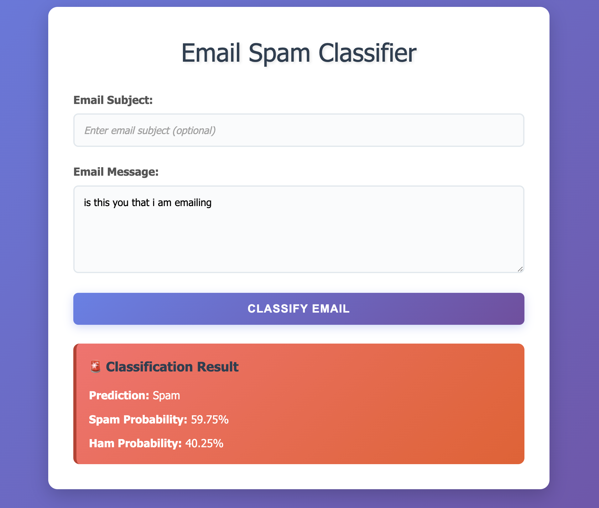
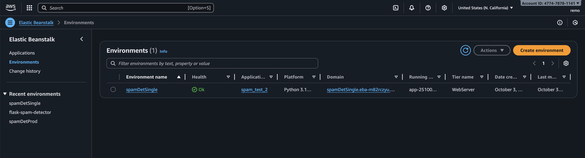

# Spam Detector Web Application

Flask web interface for real-time email spam classification.



**Note:** The live AWS deployment has been taken down to minimize costs. You can run the application locally by following the installation instructions below, or view the deployment documentation to see how it was configured for production.

## How to Start Locally

### Prerequisites
- Python 3.10+
- Virtual environment (recommended)

### What's Included
- **Pre-trained model included** (4.4MB) - no additional setup required!  
- All dependencies managed via `requirements.txt`  
- Comprehensive test suite

## Dependencies
requirements.txt
```
pandas==2.2.3
scikit-learn==1.6.1
joblib==1.4.2
numpy==2.2.4
flask
gunicorn # For the AWS Elastic beanstalk deployment
```
## Project Structure
```
spam_detector/
    ├── .ebextensions/                       #AWS EB configuration
    |    └── python.config
    ├──.elasticbeanstalk/                   # EB CLI settings (auto-generated)           
    ├── README.md                           # Deployment instructions  
    ├── app.py                              # Main Flask application
    ├── application.py                      # File that runs the Flask server  
    ├── requirements.txt                    # Flask dependencies  
    ├── models/
          └── spam_trained_model.joblib     # The trained model (4.4MB)
    ├── templates/
    |   ├──base.html             
    │   └── index.html                      # Main web interface
    └── static/
    |    ├── css/
    |        └── style.css
    └──tests\                               # App testing suite 
        ├──spmaDetectorTester.py
        └──results_dataframe.csv
```
**Note:** `application.py` is required by AWS Elastic Beanstalk.

## Installation
```bash
# Clone repository
git clone https://github.com/yourusername/spam_detector.git
cd spam_detector
```
## Environment Setup

This project was developed using Conda. You can recreate the environment using either conda or pip method:

### Option 1: Using Conda (Recommended)
```bash
conda env create -f environment.yml
conda activate spam_detector_env
```

### Option 2: Using pip
```bash
python -m venv venv
source venv/bin/activate  

# Install dependencies
pip install -r requirements.txt
```

# Run application
```bash
python app.py
```
Visit: `http://localhost:5000` or whatever you setup your port at in the app.py file

## Features

- Real-time spam classification
- Confidence scores (decision function)
- Clean, responsive UI
- Input validation
- Example emails for testing

## API Endpoints

### POST `/predict`

Classify an email as spam or ham.

**Request Body:**
```json
{
  "subject": "Meeting tomorrow",
  "message": "Hi, are we still on for the meeting tomorrow at 2pm?"
}
```

**Response:**
```json
{
  "prediction": "ham",
  "Spam Probability": "40.25%",
  "Ham Probability": "59.75%"
}
```
## Testing
### Automated Testing Suite

The project includes a comprehensive testing suite (`tests/test_spam_detector.py`) that validates the Flask API's performance across multiple scenarios.

**Test Categories:**
- Obvious spam emails (prize scams, work-from-home schemes)
- Legitimate emails (meetings, personal communication)
- Phishing attempts (fake PayPal, IRS, Amazon notifications)
- Marketing emails (newsletters, promotional content)
- Edge cases (empty subjects, very long messages)
- Error handling (malformed requests, invalid JSON)

### Running Tests
```bash
# 1. Start Flask app
python app.py

# 2. In another terminal, run tests
cd tests
python test_spam_detector.py
```
**Test Output:**
Generating Summary Report...  
Total Tests: 20  
Successful: 19  
Failed Tests: 1  
Accuracy: 71.43% (10/14 correct classifications)  


**Results saved to:** `results_dataframe.csv` with the following columns:
- email subject	
- status	
- expected prediction	
- Prediction	
- correctly_predicted	
- Ham probability	
- Spam probability	
- confidence	
- response time	
- error	expected

## Deployment
### Deploy to AWS Elastic Beanstalk

> **Note:** This application was successfully deployed to AWS EB and tested in production. The live environment has been terminated to avoid ongoing costs. Deployment documentation is preserved below for reference and future redeployment.


**Prerequisites:**
- AWS account
- AWS CLI configured with credentials

## How aws eb works:
```
Application: spam-detector-app
┌───────────────────────────────┐
│          Application          │
│ (logical project container)   │
│                               │
│  ┌───────────────────────┐    │
│  │ Environment: spam-test-env │ ← Running dev/test version
│  │ - EC2 instances            │
│  │ - Load balancer            │
│  │ - Logs, monitoring         │
│  └───────────────────────┘    │
│                               │
│  ┌───────────────────────┐    │
│  │ Environment: spam-detector-env │ ← Running production version
│  │ - EC2 instances            │
│  │ - Load balancer            │
│  │ - Logs, monitoring         │
│  └───────────────────────┘    │
└───────────────────────────────┘
```
### 1. Install EB CLI --> Elasticbeanstalk Command Line Tools 
Installation using pip (the Python package manager):
```bash
pip install --upgrade awsebcli
```
### 2. AWS Command Line Interface (AWS CLI):
Not required to run eb commands, however the AWS CLI is often used in conjunction with the EB CLI for broader AWS interactions, such as configuring credentials, managing S3 buckets, or interacting with other AWS services that the application might use.
```bash
pip install --upgrade awscli
```

# Initialize and deploy:
```bash
#initialize EB application
eb init -p python-3.10 spam-detector-app --region us-east-1 

# Create environment
eb create spam-detector-env

#Deploy application
eb deploy

#Open in browser
eb open
```
### 3. Update After Changes:
```bash
eb deploy
```

## Troubleshooting
### Issue: Model file not found
**Solution:** Ensure you've cloned the complete repository including the `models/` directory:
```bash
# Verify model exists
ls models/spam_trained_model.joblib

# If missing, re-clone the repository
git clone https://github.com/yourusername/spam-detector.git
```

### Issue: Port already in use
```bash
# Kill process on port 5000
lsof -ti:5000 | xargs kill -9
```

### Issue: ModuleNotFoundError
```bash
# Reinstall dependencies
pip install -r requirements.txt --force-reinstall
```

**This is what the aws console looks like**




##  License

MIT License - see [../LICENSE](../LICENSE)


for architecture
👉 Choose arm64 (Graviton)
unless you’re using a library that specifically requires x86 (which is rare).

Here’s why:

💰 Cheaper: up to 20% lower cost per execution.

⚡ Faster: better cold start performance and CPU efficiency.

🧩 Works perfectly with your dependencies (Flask, NumPy, pandas, joblib, awsgi).

Your app doesn’t use any compiled C extensions that break on ARM, so it’s safe.


An Execution Role is an IAM Role that tells AWS:

“What is this Lambda function allowed to do?”
Your app only needs to:

run Python code

log to CloudWatch (for debugging)

✅ That means you only need basic Lambda permissions.
and attach this policy:

AWSLambdaBasicExecutionRole

Networking → Function URL
What it is:

A Function URL gives your Lambda a direct HTTPS endpoint
— so you can access it publicly without needing API Gateway.
Under Auth type, choose:

None (public) — if you want people to be able to test your spam detector easily via browser or curl.
 do pip install <packages> -t . --> it will create a folder with installed packages so only include what I need like awsgi, flask

 zip -r app.zip . --> zip it

 do not install numpy and pandas amazon have their own

 price difference:
 - AWS Elastic Beanstalk costs approximately **$25-50/month** for a basic environment:
      - EC2 t2.micro instance: ~$8/month
      - Load Balancer: ~$15/month  
      - Data transfer: ~$2-5/month: $54/month (running 24/7 even when no one's using it)
- Lambda with Docker: Probably $0-2/month for a portfolio project
First 1 million requests/month are FREE
You only pay when someone actually uses your app
No idle server costs
- Scaling: Lambda automatically handles traffic (0 to 1000s of requests)

**Lambda expects a function, not a web server**. You'll need to either:
- Use a handler that converts Lambda events to Flask requests (using awslambdaric or similar)
- Restructure your app to have a handler function